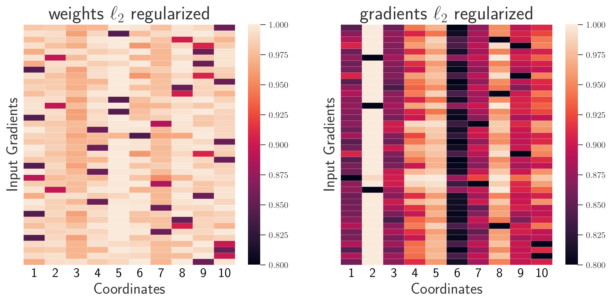

# The Role of Input Gradients as Indicators for Discriminative Features

### Project Summary

This project investigates the role of input gradients in highlighting discriminative features in neural networks (NNs). We explore the relationship between input gradients and the interpretability of neural networks, focusing on how different regularization techniques affect the robustness and clarity of these gradients. We found that different types of regularization (ℓ1, ℓ2, ℓ∞) can lead to varying trade-offs between interpretability and accuracy.

### Attribution

This project is based on the original code and ideas presented by Harshay Shah, Prateek Jain, and Praneeth Netrapalli in their repository [Do Input Gradients Highlight Discriminative Features?](https://github.com/harshays/inputgradients). 

